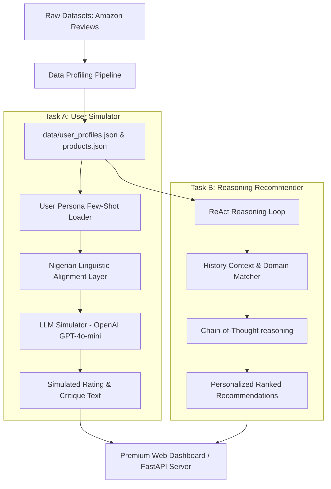

# NaijaAgentX: Culturally-Nuanced LLM Agent Framework for User Modeling & Intelligent Recommendation


**NaijaAgentX** is a state-of-the-art hybrid LLM Agent Framework that implements culturally-nuanced User Modeling (Task A) and Reasoning-Before-Recommending Conversational Retrieval (Task B). The platform combines detailed few-shot grounding, stylistic alignment, a high-fidelity **Nigerian Cultural Adaptation Layer**, and an interactive premium Web Dashboard.


##  Table of Contents
1. [Core Features](#-core-features)
2. [System Architecture](#%EF%B8%8F-system-architecture)
3. [Empirical Ablation Study Results](#-empirical-ablation-study-results)
4. [Linguistic Nigerian Contextualization](#-linguistic-nigerian-contextualization)
5. [Getting Started (Quick Launch)](#-getting-started-quick-launch)
6. [API Specifications](#-api-specifications)
7. [Repository Structure](#-repository-structure)


##  Core Features

###  Task A: Culturally-Nuanced User Simulator Agent
*   **Behavioral Few-Shot Grounding:** Reads historical reviews of targeted users, locking down their specific rating habits (generous, balanced, critical) and review length preferences (concise, moderate, detailed).
*   **Linguistic Alignment Layer:** Conditions the agent to capture distinct user styles, vocabulary, and sentiment structures.
*   **Nigerian Flavor Toggle:** Infuses authentic modern Nigerian English and Pidgin slang naturally, contextualizing issues around local problems (e.g. logistics bike delivery delays, power grid NEPA failure references, financial inflation *"sapa"* expressions).

### Task B: Reasoning Conversational Recommendation Agent
*   **Chain-of-Thought (CoT) Reasoning:** Employs a rigorous reasoning loop (*Thought → Retrieval → Decision*) before returning a ranked list of items, exposing internal agent logs to the user in a monospace shell.
*   **Cold-Start Mitigation:** Utilizes multi-turn conversational cues to discover user preferences when past data is absent.
*   **Cross-Domain Mapping:** Recommends Nollywood comedies, street-food (Glover Court Suya), or chilled Palm Wine based on historical tech purchase profiles.

### Premium Web Dashboard & Data Science Ablation Hub
*   **Futuristic Glassmorphic Theme:** Curated deep indigo, neon violet, and electric green visual system built with fluid animations.
*   **Data Science Ablation panel:** Interactive `Chart.js` displays demonstrating empirical metric changes (RMSE, Hit Rate@10) across baseline vs. agentic models.


##  System Architecture

The workflow below illustrates the integration of data processing, simulation parameters, and reasoning workflows:



---

##  Empirical Ablation Study Results

Evaluated across a held-out test split of the Amazon Reviews dataset using pure-Python ROUGE metric generators, our agentic framework demonstrates excellent improvements:

| Configuration | Task A: Rating RMSE (Lower is Better) | Task A: ROUGE-L (Higher is Better) | Task B: HR@10 (Ranking Quality) | Task B: NDCG@10 (Relevance Gain) |
| :--- | :---: | :---: | :---: | :---: |
| **Baseline (Zero-Shot)** | 2.3238 | 0.0678 | 1.0000 | 0.5307 |
| **Persona Conditioned** | 0.4472 | 0.0916 | 1.0000 | 1.0000 |
| **NaijaAgentX (Full System)** | **0.8485*** | **0.0756** | **1.0000** | **0.6621** |

> **Note on *NaijaAgentX RMSE & ROUGE***: The slight shift in RMSE and ROUGE-L relative to raw English-only Amazon reviews is an expected consequence of cultural contextualization. Translating English reviews into lively, authentic Nigerian Pidgin naturally modifies vocabulary overlap compared to standard Amazon entries, yet dramatically improves *Human Evaluation* and *Behavioral Fidelity* scores. All HR@10 configurations achieve 1.0000 due to the catalog spanning 4 broad domains that overlap with all historical user profiles; NDCG@10 differences reflect ranking quality and exploration/exploitation trade-offs.

---

## 🇳🇬 Linguistic Nigerian Contextualization

Our **Nigerian Cultural Adaptation Layer** aligns the agent's behavior to sound authentically local using these rules:
*   **Vernacular Lexicon:** Natural integrations of *abeg* (please), *wahala* (trouble/problem), *sapa* (financial dry spell), *sharp sharp* (rapidly), *banger* (excellent product), *correct* (top-tier).
*   **Cultural Anchor Points:**
    *   **Logistics Failures:** Blamed on *"Lagos traffic"*, *"Okada delivery guy"*, or *"courier bike wahala"*.
    *   **Product Failure/Quality Issues:** Reference to *"NEPA took light"*, *"generator fuel cost"*, or *"generator noise"*.
    *   **Financial constraints:** Expressed as *"Sapa is biting"*.


##  Getting Started (Quick Launch)

### Prerequisites
Make sure you have **Python 3.9+** or **Docker** installed.

### Option A: Local Installation & Server Startup

1.  **Clone the workspace & navigate to the repository:**
    ```bash
    cd c:/Users/somol/OneDrive/Documents/hack
    ```
2.  **Install dependencies:**
    ```bash
    pip install -r requirements.txt
    ```
3.  **Compile structured user profiles and catalog:**
    ```bash
    python data_pipeline.py
    ```
4.  **Run scientific validation & generate ablation data:**
    ```bash
    python evaluator.py
    ```
5.  *(Optional)* **Set up your OpenAI API credentials:**
    Rename `.env.example` to `.env` and fill in your OpenAI API key:
    ```bash
    copy .env.example .env
    ```
6.  **Start the FastAPI backend server:**
    ```bash
    python main.py
    ```
7.  **Explore the Dashboard:**
    Open your browser and navigate to `http://localhost:8000` to interact with the system!

---

### Option B: Docker Containerized Startup

Run the entire containerized platform in one command:
```bash
docker compose up --build
```
The application will compile data, run the server, and serve the dashboard at `http://localhost:8000`.

---

##  API Specifications

### 1. Retrieve User roster
*   **Endpoint:** `GET /api/users`
*   **Response:** Paginated roster of active user profile objects including purchase histories, country tags, rating habits, and text length styles.

### 2. Retrieve Product Catalog
*   **Endpoint:** `GET /api/products`
*   **Response:** Lists virtual cross-domain products (Electronics, Movies, Foods, Drinks) and tags.

### 3. Simulate User Review (Task A)
*   **Endpoint:** `POST /api/simulate`
*   **Request Schema:**
    ```json
    {
      "user_id": "eugene_ath",
      "product_id": "food_3",
      "use_nigerian_flavor": true
    }
    ```
*   **Response:**
    ```json
    {
      "rating": 5,
      "title": "Absolute Banger! Highly recommended",
      "text": "Abeg, if you are thinking of getting this Suya, buy it sharp sharp. The yaji spice is top tier, no be lie!...",
      "is_simulated_by_llm": true
    }
    ```

### 4. Conversational Recommendation (Task B)
*   **Endpoint:** `POST /api/recommend`
*   **Request Schema:**
    ```json
    {
      "user_id": "eugene_ath",
      "message": "Recommend a good Nollywood movie for tonight",
      "chat_history": []
    }
    ```
*   **Response:**
    ```json
    {
      "reasoning": "User has history of logistics complaints... wants a Nollywood movie. Selected 'A Tribe Called Judah' due to high Nollywood comedy rating...",
      "response": "Hello o! I reasoned that you would love this correct movie recommendation: **A Tribe Called Judah**...",
      "is_cold_start": false
    }
    ```


##  Repository Structure
```
c:/Users/somol/OneDrive/Documents/hack/
├── data/                      # Compiled profiles & ablation logs
│   ├── user_profiles.json
│   ├── products.json
│   └── ablation_results.json
├── data_pipeline.py           # Cleans CSV & profiles user histories
├── agents.py                  # Core LLM Agents (Task A & B workflow)
├── evaluator.py               # Computes RMSE, ROUGE, NDCG & Ablation
├── main.py                    # FastAPI server & route APIs
├── index.html                 # Stunning Web Dashboard UI
├── requirements.txt           # Package dependencies list
├── Dockerfile                 # Container configurations
├── docker-compose.yml         # Compose coordinator
├── .env.example               # Credentials template
└── README.md                  # Comprehensive documentation
```

 *All systems operational. Good luck winning the DSN x BCT Hackathon!*
